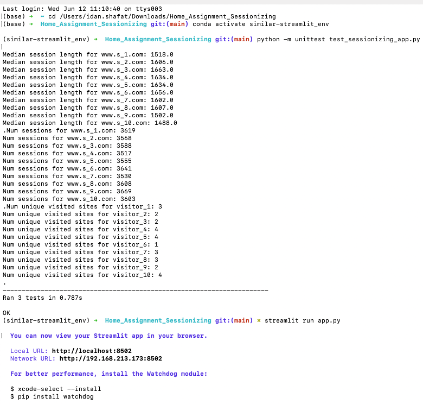
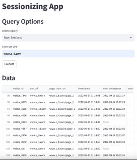
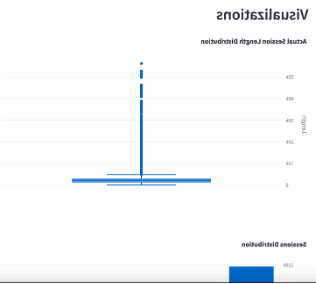
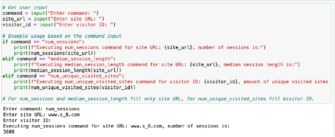
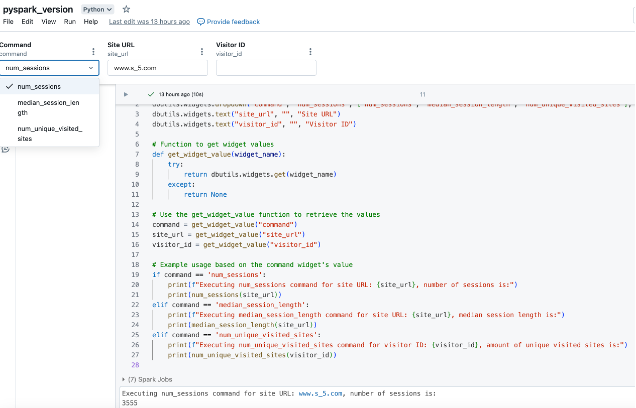

# Sessionizing App

## Overview

This project is a web application that processes page view data to provide insights into visitor sessions on websites. The main version of the application is built using Streamlit for the web interface and Pandas for data processing. The data is provided as CSV files, and the application supports queries to determine the number of sessions, the median session length, and the number of unique visited sites for a given visitor. Additional features include two bonus queries and a PySpark version for large-scale data processing.

For more detailed information on every part of the project and the theoretical questions, please refer to the [Project Guide](project_guide.docx) document in the repo.

## Project Structure

1. **app.py**: The main Streamlit application script.
2. **utils.py**: Contains utility functions for data processing and query execution.
3. **test_sessionizing_app.py**: Unit tests for the application.
4. **environment.yml**: Conda environment configuration file.
5. **streamlit_config/config.toml**: Streamlit configuration file.
6. **Given files from SW**: Includes 3 data files, instructions, and expected results.
7. **Other Versions Folder**:
   - **PySpark Version**: Written in Databricks for large-scale processing using S3.
   - **Jupyter Notebook**: Local version used for data exploration and preprocessing.

## Session and Session Length

- **Page View**: A single page of a site visited by a visitor at a specific timestamp.
- **Session**: A group of page views by a single visitor to a single site where the time between successive page views is not longer than 30 minutes.
- **Session Length**: The time difference between the first and last page views of a session. If a session contains only a single page view, the session length is zero.

## Input Data

The input data consists of CSV files with the following fields:
- `visitor_id`: A unique identifier of the visitor.
- `site_url`: The main URL of the visited website.
- `page_view_url`: The URL of the visited page.
- `timestamp`: The timestamp of the page view in Epoch time (seconds since 1/1/1970).

## Supported Queries

The application supports the following queries:
1. **Num_sessions**: Returns the number of sessions for a given site URL.
2. **Median_session_length**: Returns the median session length (in seconds) for a given site URL.
3. **Num_unique_visited_sites**: Returns the number of unique visited sites by a given visitor.
4. **Session_page_sequence**: Returns the sequence of pages visited within a session.
5. **Most_visited_pages**: Returns the most visited pages for a given site URL.

## Data Loading and Processing

The `load_and_process_data` function in `utils.py` is responsible for loading and processing the CSV files. It performs the following steps:
1. Checks if there are any CSV files in the folder.
2. Verifies column consistency across all CSV files.
3. Loads all CSV files into Pandas DataFrames.
4. Concatenates the DataFrames and removes duplicates and null values.
5. Converts the `timestamp` column to datetime format.
6. Sorts the DataFrame by `timestamp`, `visitor_id`, `site_url`, and `page_view_url`.
7. Calculates the `next_timestamp` for each page view.
8. Calculates the `session_length` based on the `next_timestamp`.
9. Identifies new sessions based on a 30-minute threshold.
10. Assigns a unique `session_id` to each session.
11. Calculates the actual session length as the difference between the first and last timestamp in each session.
12. Returns the processed DataFrame, a message indicating column consistency, and the names of the loaded files.

## Setup Instructions

### Using Conda

1. **Clone the Repository**:
   ```sh
   git clone https://github.com/Sarefet/Similar_sessionizing.git
   cd Similar_sessionizing
   ```

2. **Create and Activate the Conda Environment**:
   ```sh
   conda env create -f environment.yml
   conda activate similar-streamlit_env
   ```

3. **Run Unit Tests**:
   ```sh
   python -m unittest test_sessionizing_app.py
   ```

4. **Run the Streamlit Application**:
   ```sh
   streamlit run app.py
   ```

### Using `venv` (if not using Conda)

1. **Create a Virtual Environment**:
   ```sh
   python3 -m venv .venv
   ```

2. **Activate the Virtual Environment**:
   - On Unix or MacOS:
     ```sh
     source .venv/bin/activate
     ```
   - On Windows:
     ```cmd
     .venv\Scripts\activate
     ```

3. **Create a `requirements.txt` File**:
   ```plaintext
   pandas
   plotly
   streamlit
   ```

4. **Install Packages**:
   ```sh
   python -m pip install -r requirements.txt
   ```

## Using the Application

1. The commands will open the Streamlit application in your web browser (default URL: `http://localhost:8501`).
2. Select a query type from the dropdown menu.
3. Enter the required input values (`site_url` or `visitor_id`).
4. Click the "Execute" button to run the query and display the results (Utils notebook uses a decorator to Cache the data so that multiple executes are faster and lighter).







## Streamlit Configuration

The `streamlit_config/config.toml` file is optional and can be used to configure the Streamlit server settings. For example, it can specify the port on which the Streamlit application runs.

## Local Version Notebook

A Jupyter notebook is included in the other versions folder. This notebook was used for data exploration, preprocessing, and writing the initial versions of the functions. It can receive user input and run queries locally.



## Scaling the Solution

To support large-scale input data, the following changes can be made:
- **Distributed Computing**: Use a distributed computing framework like Apache Spark to process large datasets.
- **Data Storage**: Store the data in a distributed file system like DBFS or a cloud storage service like AWS S3.
- **Database Integration**: Use a scalable database like Apache Cassandra or Amazon DynamoDB to store and query the data.
- **Partitioning**: Partition the data based on a suitable key (like timestamp, visitor_id, or site_url) to distribute the workload across multiple nodes.
- **Broadcast Variables**: Use broadcast variables for small lookup tables to reduce shuffling.
- **Optimize Joins**: Optimize join operations by using the correct join, repartitioning data, or using broadcast joins for smaller datasets.
- **Lazy Evaluation**: Leverage Spark's lazy evaluation model to optimize performance by minimizing unnecessary computations.
- **Handling Data Skew with Salting**:
  - **Issue**: Data skew occurs when some partitions have significantly more data than others, leading to performance bottlenecks.
  - **Solution**: Salting is a technique used to handle data skew by adding a random value to the join key. This helps distribute the data more evenly across partitions.
  - **Steps**:
    1. Identify the Skewed Key: Determine which key is causing the data skew.
    2. Add Salt: Add a random salt value to the skewed key.
    3. Repartition: Repartition the data based on the salted key.
    4. Perform the Join: Use the salted key for the join operation.

## PySpark Solution

The provided code in the other versions folder uses PySpark to process and analyze web page view data at scale using cloud storage and clusters for compute systems. This version is suitable for large-scale data processing and can be integrated with various tools like Airflow, DBT, and Databricks Jobs for automation and monitoring.

## Databricks Widgets and Slack Integration

Databricks widgets allow you to add interactive input parameters to your notebooks and dashboards, enhancing interactivity and usability. These widgets can be integrated with Slack using tools like Workato, enabling non-technical users to trigger queries easily.



## Space and Time Complexity

- **Space Complexity**: Primarily determined by the size of the input data. The application loads the entire dataset into memory, so the space complexity is O(N), where N is the number of rows in the dataset.
- **Time Complexity**: 
  - **Num Sessions**: O(N) for filtering and O(1) for calculating unique session IDs.
  - **Median Session Length**: O(N) for filtering and sorting, O(N log N) for finding the median.
  - **Num Unique Visited Sites**: O(N) for filtering and O(1) for calculating unique visited sites.

## Testing

1. **Unit Tests**: Verify the correctness of individual functions (`test_sessionizing_app.py`).
2. **Integration Tests**: Ensure the entire flow works as expected, from reading CSV files to generating insights and visualizations.
3. **Manual Tests**: Compare function outputs to expected results.

## License

This project is licensed under the MIT License - see the [LICENSE](LICENSE) file for details.